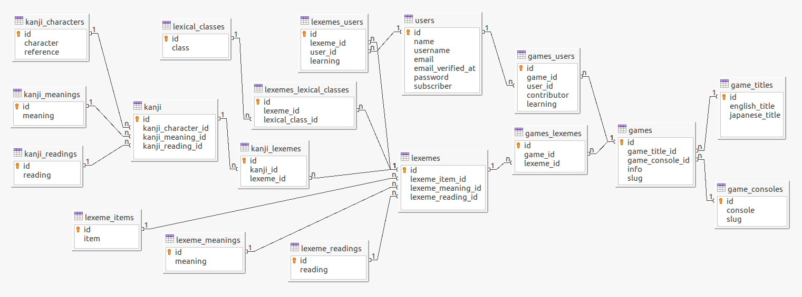

# BarrierDown

[BarrierDown.com](https://barrierdown.com/) can help you learn Japanese while playing Japanese video games.

## Features

- Flashcard program
- Frequency of flashcard reappearance controllable
- Customizable vocabulary lists
- Inserts new vocabulary into database via spreadsheets
## Author

- [@MiloRoberts](https://github.com/MiloRoberts)

## Usage

#### Getting Start
- Register an account.
- Find a game in the Games page and click "I want to study this."
- Make alterations to your word list in the My Account page as needed.

#### Flashcard program
- Go to the Flashcard page.
- Select one or more games that you've chosen to study.
- Click "flip flashcard" to reveal the flashcard's backside.
- Click "hard" to make the flashcard appear sooner or "easy" for later.
- Click "view kanji" to see details about kanji appearing on the flashcard.
- Select "stop learning" to remove a flashcard from your study list altogether.

## Database Schema

## Acknowledgements

 - [box / spout](https://github.com/box/spout) for spreadsheet reader API